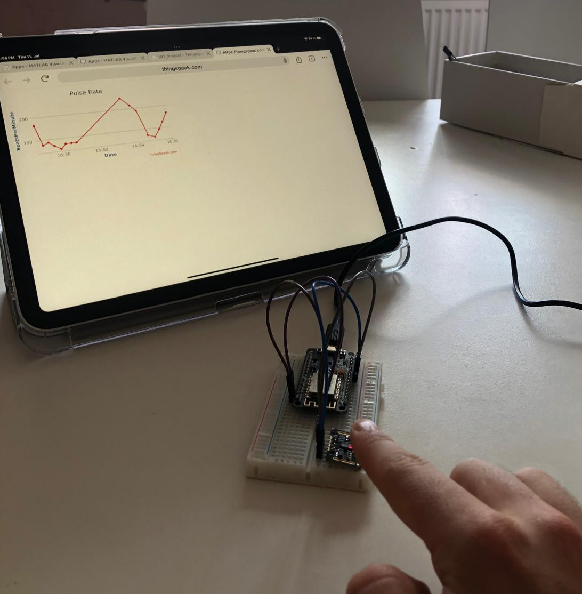
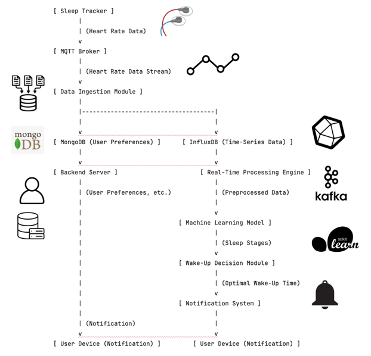
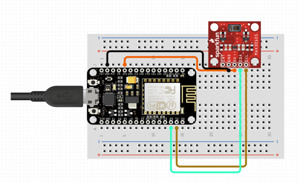
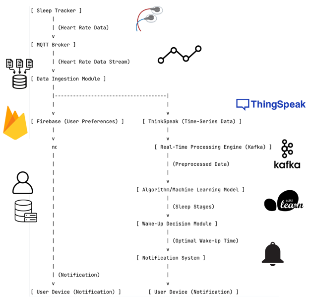
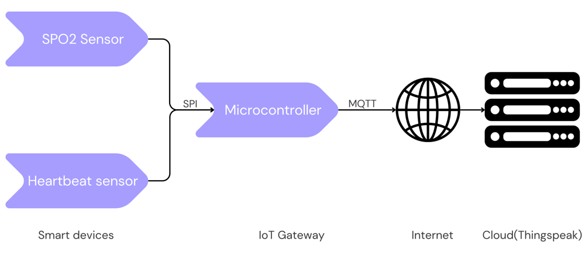
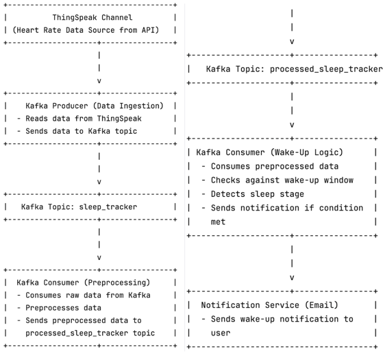
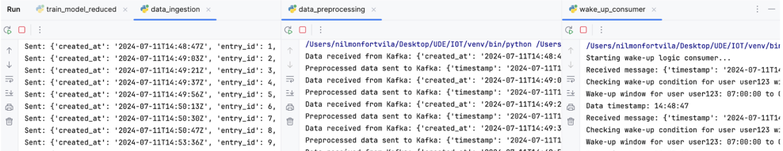
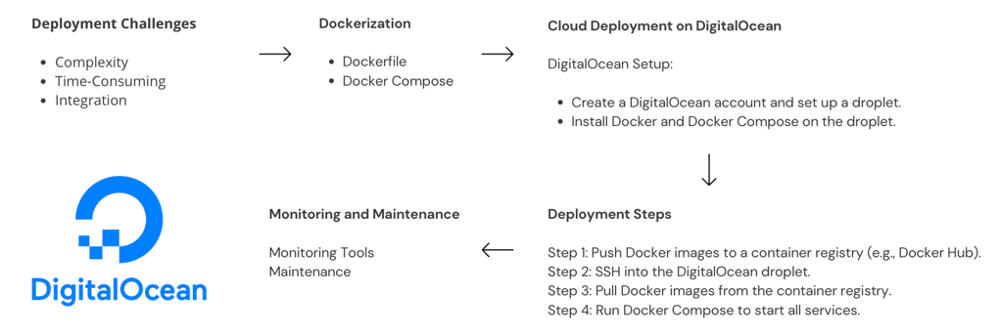

# HeartBeatTracker

## Project Overview

**Are you tired of groggy mornings?**

HeartBeatTracker aims to help you wake up feeling fully rested by using your heart rate data. Our goal is to create a system that tracks your sleep stages, analyzes your heart rate variability, and wakes you up at the best time. This ensures you feel refreshed and ready to start your day.





**Objective**: Develop a system to track and manage user activities and preferences using Firebase, Thingspeak, and machine learning. Our system aims to:
- Continuously monitor and analyze heart rate data.
- Determine sleep stages using advanced machine learning algorithms.
- Optimize wake-up times to ensure users wake up feeling rested.
- Provide real-time notifications and insights through a seamless user interface.

## System Architecture



## Components


- **Sleep Tracker (NodeMCU ESP8266 & MAX30102)**: 
  - Collects heart rate data from the user continuously. Typically a wearable device, it monitors the user's heart rate variability (HRV) and other physiological parameters, serving as the primary data source for tracking sleep patterns and overall heart health.



- **MQTT Broker**: 
  - Manages the data stream from the sleep tracker to the ingestion module. It uses the MQTT protocol to ensure reliable and efficient data transmission, acting as an intermediary that buffers and routes data to prevent data loss and ensure timely delivery.

- **Data Ingestion Module**: 
  - Processes incoming data and distributes it to the appropriate databases. 
- **MongoDB**: 
  - Stores user preferences and settings. As a NoSQL database, it is optimized for document storage and retrieval, providing a flexible and scalable solution for managing user-specific data such as preferences and profile settings.

- **InfluxDB**: 
  - **Function**: Stores time-series data from the sleep tracker.
  - **Details**: A time-series database optimized for high-write throughput and efficient querying of temporal data.
  - **Role**: Manages the large volume of heart rate and other physiological data collected over time.

- **Backend Server**: 
  - Handles user preferences, authentication, and other backend functionalities. It typically operates as a RESTful API server built using frameworks like Flask or Django, serving as the central hub for processing requests from the frontend, managing user sessions, and interfacing with the database.

- **Real-Time Processing Engine**: 
  - **Function**: Processes preprocessed data in real-time.
  - **Details**: Often uses technologies like Apache Kafka and stream processing frameworks.
  - **Role**: Enables real-time analysis and processing of incoming data streams to detect sleep stages and other metrics.

- **Machine Learning Model**: 
  - **Function**: Analyzes data to determine sleep stages.
  - **Details**: Trained on historical data to classify sleep stages based on heart rate and other physiological signals.
  - **Role**: Provides insights into the user's sleep quality and patterns.

- **Wake-Up Decision Module**: 
  - Determines the optimal wake-up time based on sleep stages. Using data from the machine learning model, it decides when to wake the user during a light sleep stage, enhancing the user's waking experience by minimizing grogginess and ensuring better rest.

- **Notification System**: 
  - Sends notifications to the user device to wake them up at the optimal time. This system can use various channels such as email, SMS, or app notifications, ensuring timely and effective communication with the user.

- **User Device**: 
  - Receives notifications and interacts with the user. This could be a smartphone, smartwatch, or other connected device, acting as the user's interface for receiving alerts, viewing sleep data, and configuring settings.

## Challenges

The initial system was highly complex with numerous components that required extensive setup and management. This complexity made deployment and maintenance challenging, leading to the decision to simplify the architecture.

## Updated Architecture

### Overview

To address the complexity, we transitioned to a simpler architecture using serverless solutions like Firebase and Thingspeak. This not only reduced the deployment burden but also increased the reliability and scalability of the system.

### Significant Changes and Advantages

- **Firebase (User Preferences)**: 
  - **Advantages**: Firebase offers a real-time database, seamless authentication, and built-in security. It simplifies data management and enhances scalability without the need for managing infrastructure.
  - **Role**: Stores user preferences, handles authentication, and provides real-time updates.

- **Thingspeak (Time-Series Data)**: 
  - **Advantages**: Thingspeak is specifically designed for IoT applications, providing easy data visualization, real-time data collection, and analysis. It is a serverless solution that reduces the need for manual setup and maintenance.
  - **Role**: Stores and visualizes time-series data from the sleep tracker.



##  Data Flow and Preprocessing



To ensure efficient and reliable handling of the heart rate data collected from the sleep tracker, our updated architecture has several modules for data ingestion, preprocessing, and decision-making. Here's an example of each component involved in the data flow and preprocessing pipeline:



### ThingSpeak Channel
- Collects heart rate data from the sleep tracker via API.
- Simplifies data collection with a serverless platform.
- Acts as the initial data source in the system.

### Kafka Producer (Data Ingestion)
- Reads heart rate data from ThingSpeak.
- Sends data to the Kafka topic `sleep_tracker`.
- Ensures efficient and reliable data streaming.

### Kafka Topic: sleep_tracker
- Stores raw heart rate data.
- Acts as a buffer between ingestion and processing.
- Enhances system robustness and scalability.

### Kafka Consumer (Preprocessing)
- Consumes raw data from `sleep_tracker` topic.
- Preprocesses data for cleaning and filtering.
- Sends preprocessed data to `processed_sleep_tracker` topic.

### Kafka Topic: processed_sleep_tracker
- Stores preprocessed heart rate data.
- Serves as an intermediary for final processing.
- Facilitates modular and manageable system design.

### Kafka Consumer (Wake-Up Logic)
- Consumes preprocessed data from `processed_sleep_tracker`.
- Checks data against user’s wake-up window.
- Detects sleep stages and sends notifications if conditions are met.

### Notification Service (Email)
- Sends wake-up notifications to user’s device, if the user has to wake up.
- Provides reliable and immediate user alerts.
- Ensures users wake up at optimal times.

# Machine Learning Model Training and Evaluation

## Training the Model

To train our machine learning model, we prepared the data from the MIT-BIH Polysomnographic Database.

### Explanation of the Process

- **Load the Data**:
  - The script reads the Database using the wfdb library to load the signal data and annotations.
  
- **Extract Features**:
  - It extracts features such as heart rate, rolling mean, and rolling standard deviation from the ECG signal and adds annotations to the data.

- **Normalize the Data**:
  - Normalized with StandardScaler.

- **Simulate Sleep Stages**:
  - For the purpose of this example, it simulates sleep stages. 
- **Train a Machine Learning Model**:
  - It prepares the data for training, splits it into training and test sets, and trains a RandomForestClassifier. The model's performance is evaluated using accuracy score, and the model is saved for later use.


### Model Evaluation Results

The model achieved an accuracy of 79.82% on the test data. Below is the detailed classification report and confusion matrix:

- **Classification Report**:
  - Precision, recall, and F1-score for each class.
  
- **Confusion Matrix**:
  - True positives, false positives, false negatives, and true negatives for each class.

```plaintext
Accuracy: 0.798195
Classification Report:
              precision    recall  f1-score   support

           0       0.55      0.03      0.06      2964
           1       0.84      0.94      0.89    989783
           2       0.08      0.02      0.03      8965
           3       0.04      0.01      0.02      1504
           4       0.29      0.13      0.18    165248
           5       0.11      0.03      0.05     31536

    accuracy                           0.80  1200000
   macro avg       0.32      0.19      0.20  1200000
weighted avg       0.74      0.80      0.76  1200000

Confusion Matrix:
[[     99    2856       0       0       8       1]
 [     67  934849    1747     24   4747    5401]
 [      0    7950     190     15     743     67]
 [      0    1334      18     14     129      9]
 [     10  140773     439     57   21774   2195]
 [      4   26433      60      9    4122    908]]
```
## Future Work

### CI/CD, Model Hyperparameter Tuning, and Model Refinement
- **CI/CD**: Enhance the CI/CD pipelines to ensure seamless integration and deployment of new features.
- **Model Hyperparameter Tuning**: Experiment with hyperparameter tuning to improve the model's performance.
- **Model Refinement**: Explore using advanced models like Recurrent Neural Networks (RNNs) such as Long Short-Term Memory (LSTM) networks for better accuracy.

### Testing and Optimization
- **Endpoint Testing**: Thoroughly test all endpoints to ensure robustness and reliability.
- **System Optimization**: Identify bottlenecks and optimize the system for improved performance and efficiency.

### Deployment
- **Docker and Docker Compose**: Create Dockerfiles and Docker Compose configurations for all services.
- **Digital Ocean Deployment**: Deploy the entire system on Digital Ocean to make it accessible and scalable.



## Team Members

### Faisal Khan
- **Role**: Hardware Development and MQTT Implementation
  - Designed and implemented the hardware components.
  - Developed the MQTT broker for managing data streams.
  - Set up data storage on the cloud using Thingspeak.
- **LinkedIn**: [Faisal Khan](https://www.linkedin.com/in/faizalwho)
- **GitHub**: [faizalwho](https://github.com/faizalwho)

### Piero Oliva
- **Role**: Hardware Development and MQTT Implementation
  - Collaborated on designing and implementing hardware components.
  - Assisted in the development of the MQTT broker for data management.
  - Contributed to setting up cloud data storage with Thingspeak.
- **LinkedIn**: [Piero Engineer](https://www.linkedin.com/in/pieroengineerperu/)
- **GitHub**: [PieroDeveloper](https://github.com/PieroDeveloper)

### Sara Martin
- **Role**: Frontend Development and Firebase Integration
  - Developed the frontend application for user interaction.
  - Integrated Firebase for authentication and real-time database functionality.
- **LinkedIn**: *LinkedIn profile link*
- **GitHub**: *GitHub profile link*

### Nil Monfort
- **Role**: System Architecture and Backend Development
  - Designed the overall system architecture.
  - Implemented backend services and machine learning models.
  - Managed the deployment and integration of various components.
- **LinkedIn**: *Your LinkedIn profile link*
- **GitHub**: *Your GitHub profile link*

## Contribution Guidelines

1. Fork the repository.
2. Create a new branch (`git checkout -b feature-branch`).
3. Commit your changes (`git commit -m 'Add some feature'`).
4. Push to the branch (`git push origin feature-branch`).
5. Open a pull request.

## License

This project is licensed under the MIT License - see the [LICENSE](LICENSE) file for details.

## Contact

For any questions or suggestions, please contact [nilmonfort98@gmail.com]() .

